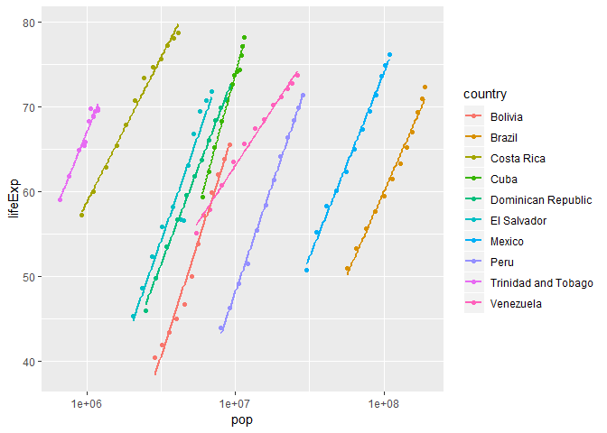
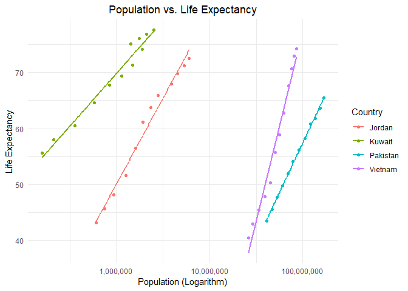
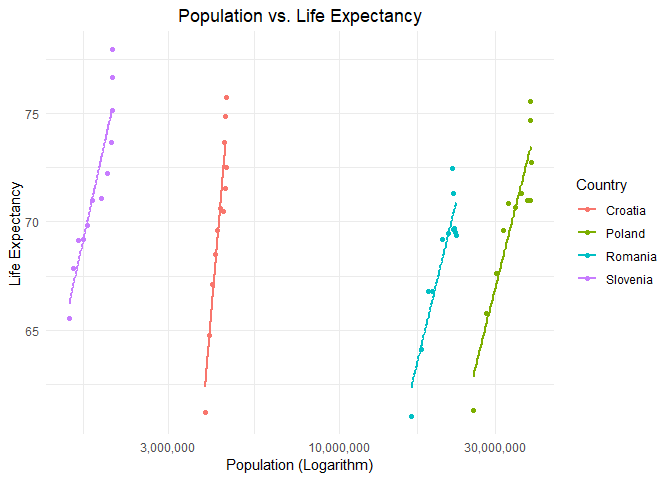
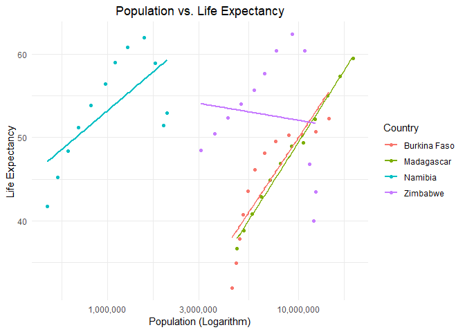
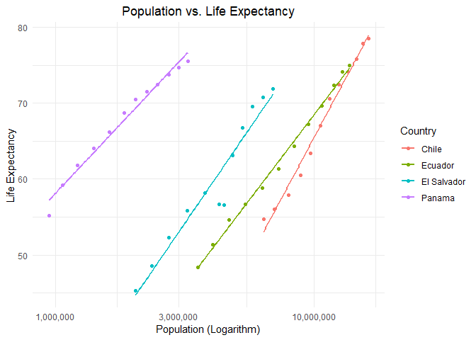

hw06-aidanh14
================
Aidan Hughes
November 7, 2018

Overview
========

Taken from the [homework HTML file](http://stat545.com/Classroom/assignments/hw05/hw05.html), here are the two topics I chose to complete for this assignment:

-   Write one (or more) functions that do something useful to pieces of the Gapminder or Singer data.

-   Create a nested data frame and map a function over the list column holding the nested data. Use list extraction or other functions to pull interesting information out of these results and work your way back to a simple data frame you can visualize and explore.

Before getting started, let load the necessary packages.

``` r
suppressPackageStartupMessages(library("gapminder"))
suppressPackageStartupMessages(library("tidyverse"))
suppressPackageStartupMessages(library("scales"))
suppressPackageStartupMessages(library("MASS"))
suppressPackageStartupMessages(library("broom"))
```

Part 1: Writing a function
==========================

Let's write a function that takes Gapminder data on a single continent and plots a linear a regression of population vs. life expectancy for a ranom set of countries. This will be useful in **Part 2: Working With Nested Frames**.

As always we should walk before we run, so we'll get the functionality working on a sample dataset first.

``` r
america_gap <- gapminder %>%
  filter(continent == "Americas")

# randomly choose sample indexes for countries in the dataset
some_countries <- america_gap$country %>%
  unique() %>% {
    rand_nums <- sample(1:length(.), size = 10)
    .[rand_nums] }

some_countries
```

    ##  [1] Peru                Costa Rica          Trinidad and Tobago
    ##  [4] Brazil              Mexico              Cuba               
    ##  [7] Dominican Republic  Bolivia             Venezuela          
    ## [10] El Salvador        
    ## 142 Levels: Afghanistan Albania Algeria Angola Argentina ... Zimbabwe

``` r
america_gap %>%
  group_by(country) %>%
  filter(country %in% some_countries) %>%
  ggplot(aes(x = pop, y = lifeExp)) +
  geom_point(aes(pop, lifeExp, colour = country)) +
  geom_smooth(aes(pop, lifeExp, colour = country), method = "lm", se = FALSE) +
  scale_x_log10()
```



Now that we've got the code working, let's store it as a function and try it on a different dataset.

``` r
gap_linreg <- function (continent_df, num_countries) {
  
  try(continent_df <- unnest(continent_df))
  
  # randomly choose sample indexes for countries in the dataset
  some_countries <- continent_df$country %>%
    unique() %>% {
      rand_nums <- sample(1:length(.), size = min(num_countries, length(.)))
      .[rand_nums] }
  
  continent_df %>%
    group_by(country) %>%
    filter(country %in% some_countries) %>%
    ggplot(aes(x = pop, y = lifeExp)) +
    geom_point(aes(pop, lifeExp, colour = country)) +
    geom_smooth(aes(pop, lifeExp, colour = country), method = "lm", se = FALSE) +
    scale_x_log10(labels = comma_format()) +
    theme_minimal() +
    labs(x = "Population (Logarithm)",
         y = "Life Expectancy",
         title = "Population vs. Life Expectancy",
         colour = "Country") +
    theme(plot.title = element_text(hjust = 0.5))
  
}

gapminder %>%
  filter(continent == "Europe") %>%
  gap_linreg(num_countries = 5)
```


Part 2: Working with Nested Dataframes
======================================

Nesting the Gapminder dataset by continent makes it easy to apply the function `gap_linreg()` from the last

``` r
cont_nests <- gapminder %>%
  group_by(continent) %>%
  nest()
  
map(cont_nests[["data"]], gap_linreg, 4)
```

    ## [[1]]



    ## 
    ## [[2]]



    ## 
    ## [[3]]



    ## 
    ## [[4]]



    ## 
    ## [[5]]


We can make another quick function to get the slope and intercept of the robust linear regression model.

``` r
temp_fun <- function (df) rlm(lifeExp ~ pop, df)

cont_rlm <- cont_nests %>%
  mutate("results" = map(.[["data"]], temp_fun),
         "tidy_results" = map(results, tidy)) %>%
  unnest(tidy_results)

knitr::kable(cont_rlm)
```

| continent | term        |    estimate|  std.error|    statistic|
|:----------|:------------|-----------:|----------:|------------:|
| Asia      | (Intercept) |  60.3005929|  0.6765123|   89.1345159|
| Asia      | pop         |   0.0000000|  0.0000000|    0.4896024|
| Europe    | (Intercept) |  72.0875814|  0.3295220|  218.7641203|
| Europe    | pop         |   0.0000000|  0.0000000|    1.4574534|
| Africa    | (Intercept) |  47.6379152|  0.4295632|  110.8985079|
| Africa    | pop         |   0.0000001|  0.0000000|    2.9525377|
| Americas  | (Intercept) |  64.3060507|  0.5917385|  108.6730952|
| Americas  | pop         |   0.0000000|  0.0000000|    3.8980150|
| Oceania   | (Intercept) |  71.7591076|  1.2984393|   55.2656605|
| Oceania   | pop         |   0.0000003|  0.0000001|    2.2913859|

``` r
tidy(cont_rlm[[1, "results"]])
```

    ## # A tibble: 0 x 0
